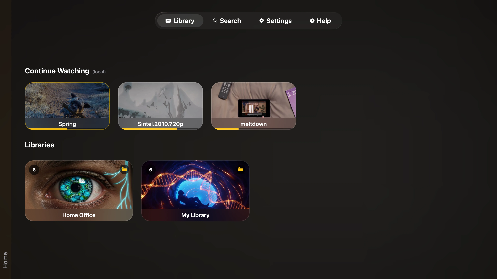
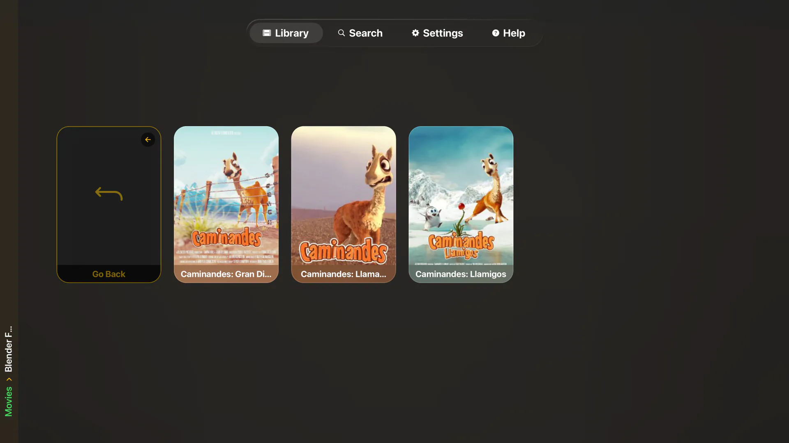
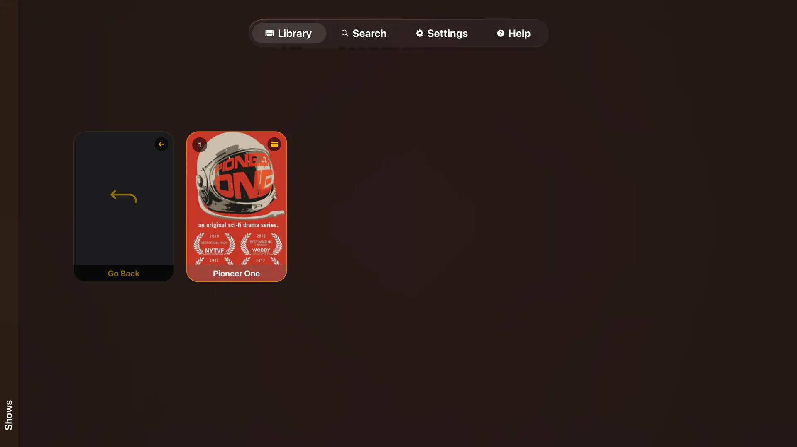
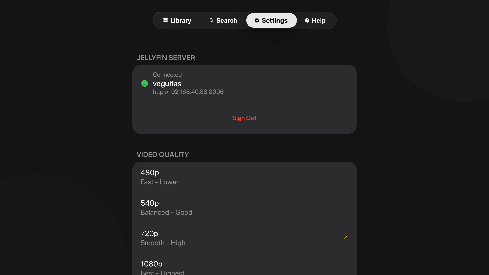
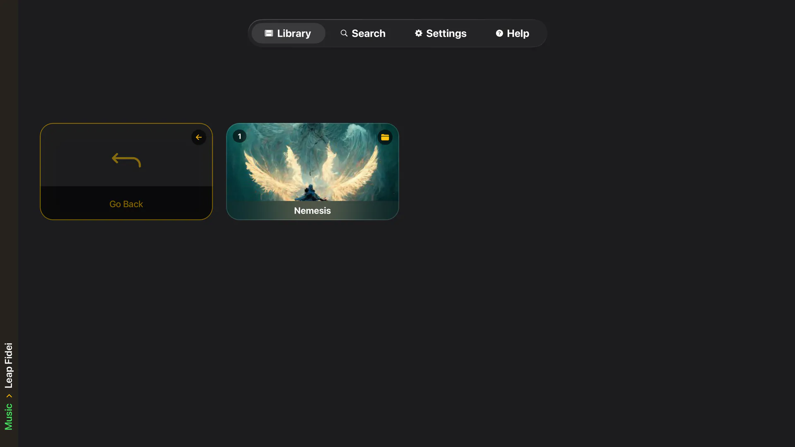
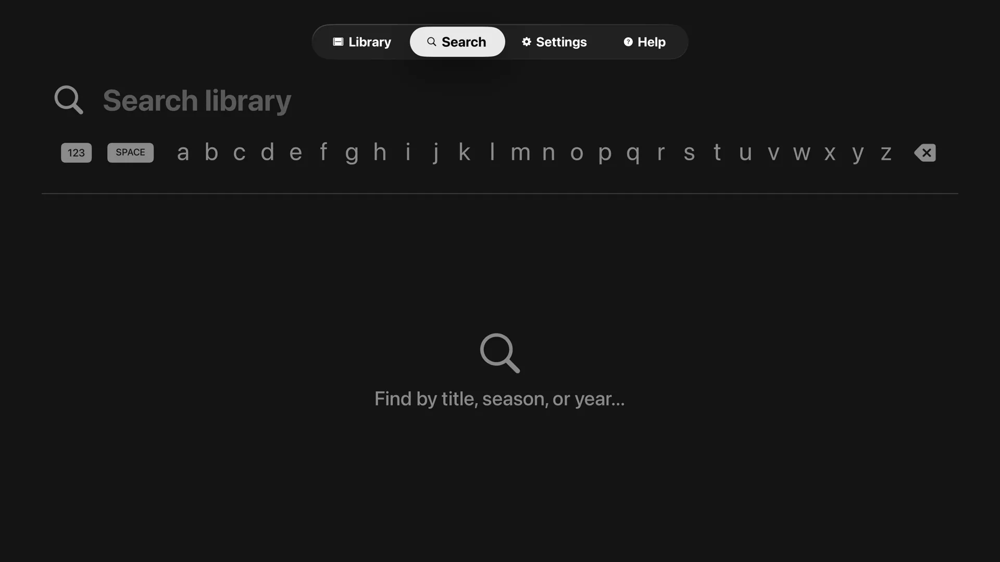
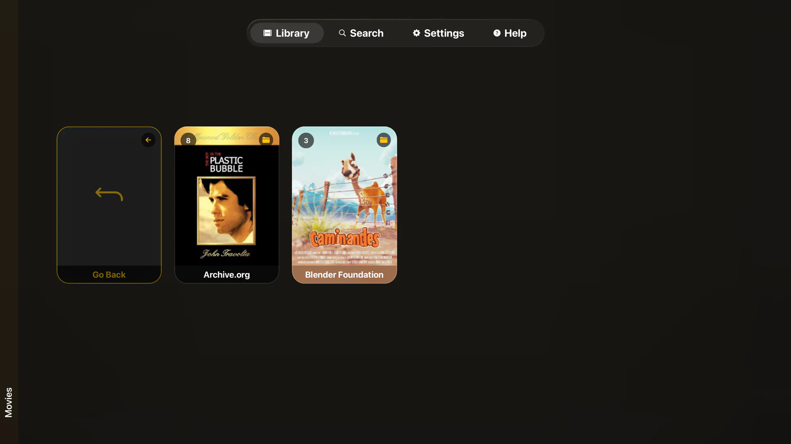
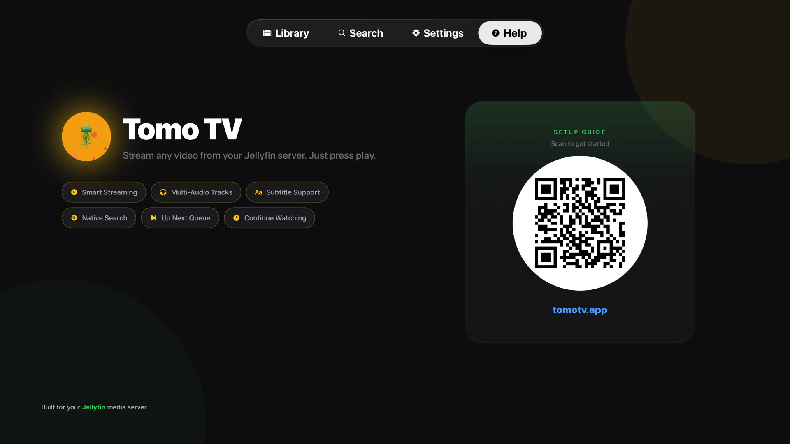
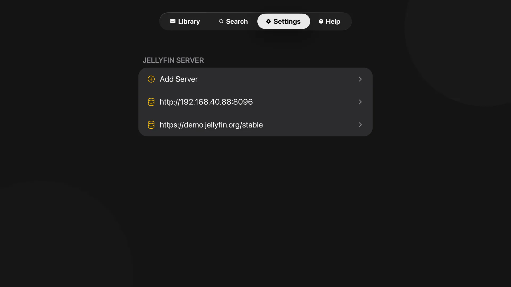

# Tomo TV - Jellyfin Client for Apple TV

[](LICENSE)
[](https://apps.apple.com/us/app/tomo-tv/id6755077888)
[](package.json)
[](https://apps.apple.com/us/app/tomo-tv/id6755077888)

A Jellyfin client for Apple TV. Stream any video from your server, switch audio
tracks mid-playback, and let codec handling sort itself out. Just press play.

<p align="center">
  
</p>

<table>
  <tr>
    <td align="center">
      <br/>
      <sub>Collections</sub>
    </td>
    <td align="center">
      <br/>
      <sub>Shows</sub>
    </td>
   <td align="center">
      <br/>
      <sub>Connected</sub>
    </td>
  </tr>
  <tr>
    <td align="center">
      <br/>
      <sub>Music</sub>
    </td>
    <td align="center">
      <br/>
      <sub>Native search</sub>
    </td>
    <td align="center">
      <br/>
      <sub>Movies</sub>
    </td>
  </tr>
</table>

## Why TomoTV

Built from the ground up for Apple TV with a focus on seamless playback. Switch
audio tracks mid-video without restarting, thanks to custom HLS manifest
generation in a native Swift module. Codec compatibility is handled
automatically, so you spend time watching instead of troubleshooting.

## Features

- **Smart streaming.** Direct plays H.264 and HEVC, auto-transcodes everything else.
- **Multi-audio tracks.** Change the audio track mid-playback without restarting, using custom multivariant HLS manifests.
- **Subtitle support.** External (.srt) and embedded tracks through the native tvOS picker.
- **Native search.** SwiftUI-powered, with proper tvOS focus navigation. Find by title, season, or year.
- **Up next queue.** Auto-advances through seasons and playlists.
- **Continue watching.** Resume from your last position.
- **Folder browsing.** Walk your library by folders, collections, seasons, and playlists.
- **Demo mode.** Try it instantly against Jellyfin's public demo server.
- **Secure by default.** Credentials stored in the device Keychain.

<p align="center">
  
</p>

## Installation

### Prerequisites

- **Jellyfin Server 10.8+** with transcoding enabled
- **Node.js 18+** and npm
- **Xcode 15+**
- **Apple TV** or tvOS simulator

### Setup

```bash
# Clone the repository
git clone https://github.com/keiver/tomotv.git
cd tomotv

# Install dependencies
npm install

# Prebuild for tvOS
npm run prebuild:tv

# Run on tvOS simulator
npm run ios

# Or build for an Apple TV device
npx expo run:ios
```

### Connect to your server

Open **Settings**, add your server by IP address (or full URL), and authorize
with a Quick Connect code or username and password. Add as many servers as you
like and switch between them, including Jellyfin's public demo.

<p align="center">
  
</p>

### Video quality

Tomo TV supports 480p, 540p, 720p, 1080p, and 4K transcoding presets.
Configure under **Settings → Video Quality**.

### Network requirements

- **All networks:** HTTP and HTTPS are allowed via `NSAllowsArbitraryLoads`.
- **Remote servers:** HTTPS is strongly recommended. HTTP exposes credentials in plaintext.

## Development

```bash
npm start            # Start dev server
npm run ios          # Build and run
npm test             # Run tests
npm run lint         # Lint and auto-fix
npm run prebuild:tv  # Rebuild native projects (deletes ios/ folder)
```

**Native code:** Always edit files in the `native/` folder. The `ios/` folder
is regenerated by prebuild, and any direct edits there are lost.

## A Note on AI

I use Claude as a development tool for drafting code and documentation.
Architecture and decisions are mine. Blame me for any shady code.

## Contributing

Contributions are welcome. Fork the repo, branch from `main`, follow the
existing patterns, add tests for new functionality, and run `npm test` and
`npm run lint` before opening a PR.

**Code standards:** strict TypeScript (no unjustified `any`), try-catch around
async work, proper React cleanup, and border-only focus feedback (no scale
animations on grid items).

## Known Limitations

- **Codec support:** Only H.264 and HEVC direct play. Everything else transcodes.
- **Platform:** tvOS only. Android is not supported for now.
- **Network:** HTTP is allowed on all networks. HTTPS is recommended for remote servers.
- **Server:** Jellyfin only. Not compatible with Plex, Emby, or others.

## License

MIT License. See [LICENSE](LICENSE) for details.

## Acknowledgments

- **Jellyfin Team** for the open-source media server
- **Expo Team** for React Native TVOS support
- **Blender Foundation** for open movie test files (Sintel, Elephants Dream, Caminandes)
- **IETF** for Matroska test files used in development

## Links

- **Documentation:** [tomotv.app](https://tomotv.app/)
- **Support:** <contact@keiver.dev>
- **Demo server:** Jellyfin's official demo at demo.jellyfin.org
- **expo-tvos-search:** [github.com/keiver/expo-tvos-search](https://github.com/keiver/expo-tvos-search)
  </content>
  </invoke>
